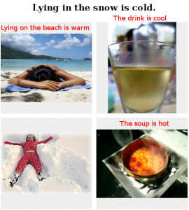

+++
title = "Pictures keep you honest"
date = 2010-10-25T18:53:47+00:00
authors = "ian"
categories = ["drumbeat"]
tags = ["collaborative language education", "drumbeat", "language", "language education", "open web", "shuttleworth", "shuttleworth foundation", "wikiotics", "wikipedia"]
+++

One week later I am proud to announce that our weather lesson is both more attractive and much more effective thanks to some great collaboration by our users.

")")

You can see that the new pictures are much easier to tell apart, especially the raining and snowing ones. In addition, the sun is now clearly visible in the “sunny” picture and there is no Eiffel tower in the “cloudy” picture to cause confusion about subject.

## Lessons of the collaboration

It was great to collaborate with some other users on this lesson, try out our tools for working together on a single lesson, and all the other things this push was designed to accomplish, but the best part for me was seeing how the structure of the lesson helped to keep us honest and keep our work useful.

The original weather lesson contained three types of vocabulary: words to talk about light (cloudy/sunny), words to talk about precipitation (raining/snowing), and words to talk about temperatures (hot/cold/cool/warm). As we all tried to find better pictures for the lesson, it became clear that this last group, the temperature words, was giving everyone trouble.

The problem was simple, we fell into the native speaker trap of trying to combine too many concepts in a single lesson. Temperature is much more easily illustrated as a property of things, like foods or beverages, rather than by pointing a camera outside and trying to capture the essence of “cold”. When we tried that, we all came up with different representations, some were animals in the sun, some were people outside surrounded by fall foliage.

Instead of depending on these personal cues, we broke temperature out into a separate “[Temperature lesson](/en/Temperature?oldid=686)” and combined all of the best weather pictures into a [Best of Weather](/en/Weather_Best_of?oldid=680) lesson. The result is much more grounded and easy to incorporate into other lessons through shared vocabulary.

## Teaching what they need to know

It is all too easy when trying to teach someone material that you know very well, like your native language, to gloss over the complexity underneath and forget just how much information there is to share. Breaking that material apart and illustrating it are great ways to keep your lessons useful to those who are coming at them with fresh eyes. If you are interested in trying such a system, give [wikiotics](/) a try.

Special thanks to jchan, Qalthos, stevensne, colannino, and trose, for building their own versions of the lesson and making the collaboration possible.

*Crossposted with [churchkey.org](https://churchkey.org/2010/10/25/pictures-keep-you-honest/)*
